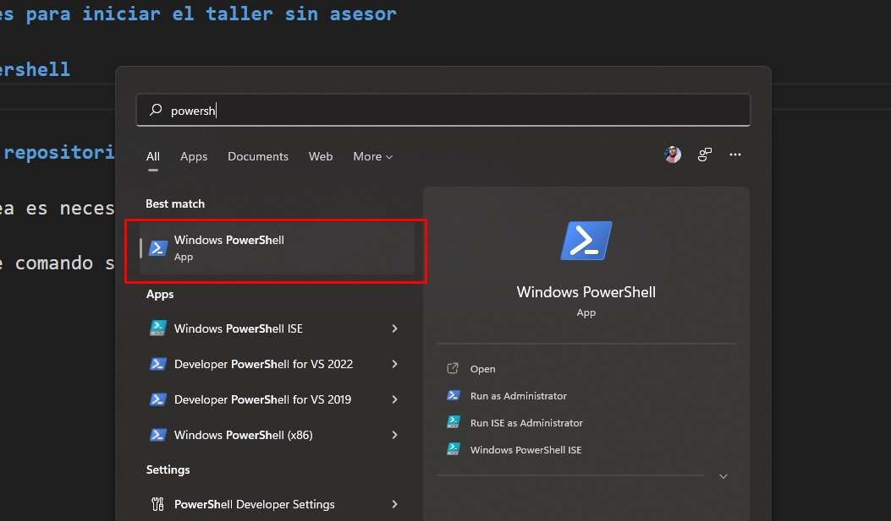
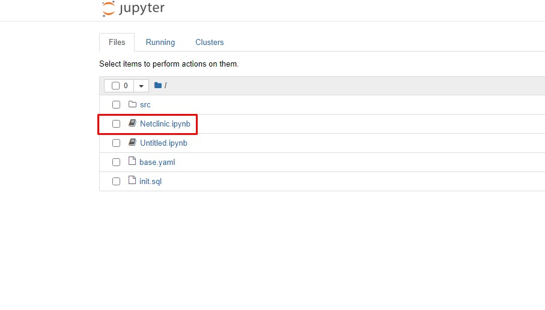
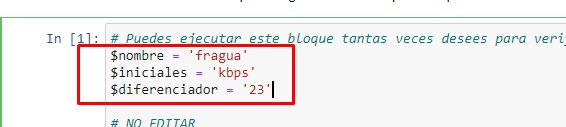
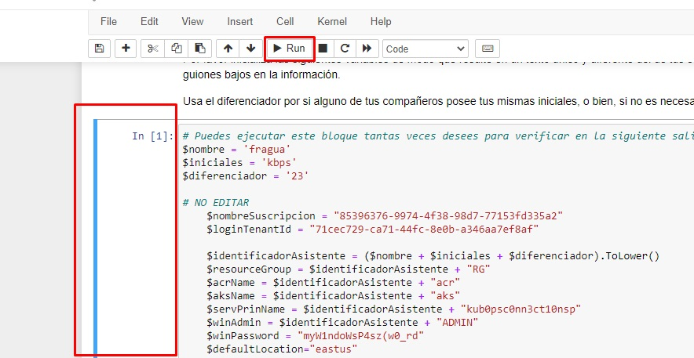

# iniciokubops

## Indicaciones para iniciar el taller sin asesor

### 10 - Abrir powershell

Ejecutar Powershell, ir a inicio y buscar Powershell. Asegurarse de no ejecutar ISE, u otra versión alterna.
En las máquinas virtuales del curso, Powershell se encuentra directamente en la barra de tareas.



### 20 - Crear y Navegar a un directorio de trabajo

Es necesario navegar a un directorio de trabajo, en este ejemplo se creará una carpeta llamada kubernetes en el disco local c:

**Crear directorio:**

```powershell
mkdir c:/kubernetes
```

**Navegar al directorio:**

```powershell
cd c:/kubernetes
```

### 30 - Clonar el repositorio base

Para esta tarea es necesario ejecutar el siguiente comando:

**NOTA:** Este comando solo funcionará desde las máquinas virtuales del curso.

```powershell
git clone https://github.com/Kahuna-Honu/KubOps.git
```

### 40 - Navegar al directorio del proyecto y ejecutar Jupyter Notebook

En la misma pantalla de powershell ejecutar el siguiente comando:

**Navegar al directorio:**

```powershell
cd KubOps\Lab\Notebooks\Netclinic
```

**Iniciar Jupyter Notebook:**

```powershell
jupyter notebook
```

Este comandó hará que la siguiente pantalla se despliegue, donde se podrá abrir el notebook.



### 50 - Una vez abierto el notebook, inicializar las siguientes variables:

**Utilizar los mismos valores que en la imagen para $nombre e $iniciales, en diferenciador usar el mismo número asignado en el usuario del curso con el que se ingresa al portal de Azure**



### 60 - Ejecutar paso a paso las celdas de código del taller.

Para esto se debe de hacer click en la izquierda de la celda, para marcarla en color azul y posteriormente, hacer click en el botón Run, en la parte superior.

